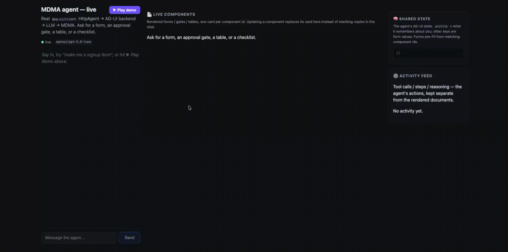

# AG-UI integration example

An end-to-end example of driving **MDMA** through the **[AG-UI](https://github.com/ag-ui-protocol/ag-ui) protocol**.



## What

An agent that answers with **real interactive UI instead of just text**. Ask it for a bug report and it
renders an actual form next to the chat. Describe what broke and it fills the fields in. Say *"set
severity to high"* and that single field updates in place — no duplicate form, nothing retyped.

## Why

MDMA components are **headless**: a document describes *intent* (fields, types, actions) and takes its
*values* from state. Wiring that into a conversation needs a transport that can stream documents, carry
shared state, and pause for a human. AG-UI standardizes exactly those three things, so the two compose
without bespoke plumbing:

- the agent **builds** a component — `generate_mdma` → AG-UI `CUSTOM` event, deliberately off the prose
  channel so no markup leaks into the chat;
- the agent **writes values** — `set_state` → `STATE_SNAPSHOT`, and rendered components hydrate from it,
  including reactively, after they're already on screen;
- the agent **waits for a human** — an approval gate parks the run on an AG-UI interrupt, and
  `runAgent({ resume })` picks it back up.

The payoff: structured data lives in shared state as the single source of truth, instead of being
retyped as prose and re-parsed on every turn.

## How it fits together

```
React FE ─ @ag-ui/client HttpAgent ─▶ AG-UI backend ─▶ LLM (OpenRouter) ─▶ MDMA
   ▲                                                                        │
   └──────────── @mobile-reality/mdma-agui bridge renders it ◀──────────────┘
```

The frontend uses a real `@ag-ui/client` `HttpAgent`; the backend is a small Node server that speaks
the AG-UI event protocol (via `@ag-ui/encoder`) and runs a tool-calling agent over OpenRouter, primed
with the MDMA agent prompt from `@mobile-reality/mdma-prompt-pack`. The
[`@mobile-reality/mdma-agui`](../../../packages/agui) bridge turns the streamed events into rendered,
interactive MDMA components.

## What it demonstrates

- **MDMA delivery over a CUSTOM event channel** — the model calls a `generate_mdma` tool; the document
  is emitted out-of-band as an AG-UI `CUSTOM` event, prose on `TEXT_MESSAGE`.
- **Human-in-the-loop** — approval gates park the run on an AG-UI interrupt; approving/denying resumes
  it in place (`runAgent({ resume })`).
- **Shared state** — a `set_state` tool writes AG-UI shared state; rendered forms hydrate from it
  (including reactively, after they've already been shown).
- **Agentic activity feed** — tool calls surface in a side panel, separate from the rendered documents.
- **Live components panel** — rendered components appear in a dedicated panel (one card per component
  id), so the chat thread stays a conversation.

## Run it

```bash
cp .env.example .env      # add your OpenRouter key + pick a model

pnpm backend              # backend  → http://localhost:8787
pnpm dev                  # frontend → http://localhost:5188
```

Then open http://localhost:5188 and try: *"make me a signup form"*, *"my email is you@example.com"*,
*"I need an approval gate to deploy to prod"*.

Or hit **▶ Play demo** in the header to replay a scripted bug-report conversation hands-free (renders a
form, fills it via `set_state`, then sets severity in place). Play reloads with `?demo=1` so each run
starts from a clean thread — it drives the live LLM, so replays are close but not byte-identical.

## Verify

```bash
pnpm verify                # boots a backend if none is running, then asserts against the event stream
```

`verify.mjs` checks that **value changes** on an already-rendered component (*"set the severity to high"*)
route to `set_state` and update in place — **without** re-rendering — while **structural changes**
(*"add a phone field"*) still re-render via `generate_mdma`. It makes real LLM calls, so it needs
`OPENROUTER_API_KEY` in `.env`.

## Config (`.env`)

| var | meaning |
|---|---|
| `OPENROUTER_API_KEY` | your OpenRouter key (required) |
| `MDMA_MODEL` | any OpenRouter model slug (e.g. `openai/gpt-5.6-luna`, `anthropic/claude-3.5-sonnet`) |
| `PORT` | backend port (default `8787`; the FE expects `8787`) |

The agent prompt variant is derived from `MDMA_MODEL` — the prompt-pack picks the tuned variant for that
exact slug, else the provider family, else a generic default. `/health` reports which one resolved.
